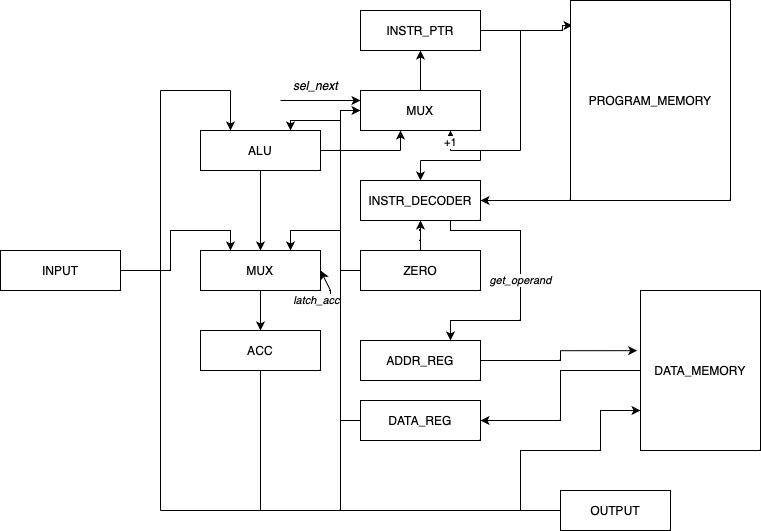

# Лабораторная работа #3
Корепанов Матвей P33101

Вариант: `asm | acc | harv | hw | instr | binary | stream | port | prob5`


## Структура проекта
Исполняемые файлы:
- `bin/translator.py` - бинарник, который получает на вход код `.asm`, а выводит бинарник `.out`
- `bin/run.py` - виртуальная машина, которая будет исполнять код, на вход получает `.out` и файл с входными данными `.txt`

Прочее:
- `machine/isa.py` - instruction set architecture, описывает опкоды и архитектуру команд
- `machine/simulation.py` - содержит реализацию виртуальной машины
- `machine/translator.py` - реализация транслятора из ассемблера в машинный код


## Описание языка
Упрощённый язык ассемблера в расширенной форме Бэкуса — Наура:
```
<letter> ::= "A" | "B" | "C" | "D" | "E" | "F" | "G"
       | "H" | "I" | "J" | "K" | "L" | "M" | "N"
       | "O" | "P" | "Q" | "R" | "S" | "T" | "U"
       | "V" | "W" | "X" | "Y" | "Z" | "a" | "b"
       | "c" | "d" | "e" | "f" | "g" | "h" | "i"
       | "j" | "k" | "l" | "m" | "n" | "o" | "p"
       | "q" | "r" | "s" | "t" | "u" | "v" | "w"
       | "x" | "y" | "z" | "_"
<name> ::= <letter> <name> | <letter>
<label> ::= "$" <name> | "." <name> | <name>

<digit> ::= "0" | "1" | "2" | "3" | "4" | "5" | "6" | "7" | "8" | "9" 
<number> ::= <digit> <number> | <digit>

<empty_expr> ::= "\n"

<op_0_arg> ::= "hlt" | "in" | "out"
<op_1_arg> ::= "st" | "ld" | "add" | "mul" | "div" | "mod" | "cmp" | "jmp" | "je" | "word" | "db"
<label_def> ::= <name> ":" | "section .text" | "section .data"

<line> ::= <label_def> | <op_0_arg> | <op_1_arg> " " <label> |  <op_1_arg> " " <label> | <empty_expr>

<program> ::= <line> <program> | <line>
```


## ISA/mnemonics

У операндов поддержано три режима адресации:

| мнемоника          | количество тактов                                                                            |
|:-------------------|:---------------------------------------------------------------------------------------------|
| `CONSTANT`         | операнд хранится непосредственно в команде                                                   |
| `DIRECT_ADDRESS`   | операнд - это значение, лежащее по адресу, хранящемся в команде                              |
| `INDIRECT_ADDRESS` | операнд - это значение, лежащее по адресу, хранящемся в ячейке, на которую указывает команда |


Система команд:

| мнемоника | минимальное количество тактов | тип операнда                      | описанаие команды                           |
|:----------|-------------------------------|:----------------------------------|:--------------------------------------------|
| `out`     | 2                             | `-`                               | распечатать в output stream значение из acc |
| `in`      | 2                             | `-`                               | прочитать в acc значение из input stream    |
| `hlt`     | -                             | `-`                               | поставить процессор на паузу                |
| `ld`      | 2                             | `const/direct_addr/inderect_addr` | загрузить значение в acc                    |
| `st`      | 2                             | `direct_addr/inderect_addr`       | сохранить значение из acc в память          |
| `add`     | 2                             | `const/direct_addr/inderect_addr` | прибавить к acc аргумент                    |
| `mul`     | 2                             | `const/direct_addr/inderect_addr` | умножить acc на значение                    |
| `div`     | 2                             | `const/direct_addr/inderect_addr` | целочисленно поделить acc на значение       |
| `mod`     | 2                             | `const/direct_addr/inderect_addr` | получить остаток от деления acc на значение |
| `cmp`     | 1                             | `const/direct_addr/inderect_addr` | сравнить acc со значением                   |
| `jmp`     | 1                             | `direct_addr`                     | безусловный переход на аргумент-метку       |
| `je`      | 1                             | `direct_addr`                     | переход на аргумент-метку, если равно       |


## Транслятор
Транслирует код на языке ассемблера в машинные инструкции (бинарный формат).

Формат бинарного файла:
Программа представлена набором 32-битных чисел.
Первое число представляет собой размер секции данных в машинных словах.
За ним следует сама секция данных (массив знаковых 32-битных чисел).
После секции данных идет секция кода.
Команды представлены в бинарном коде 32-битными числами, последние 3 бита задают тип операнда.
0 - операнд отсутствует
1 - прямая адресация
2 - косвенная адресация
3 - константа
В случаях 1 - 3 после команды идет число, соответствующее значению оперданда.

Пример исходного кода `hello.asm`:
```asm
section .data
    curr_char: word 1
    hellow: db "hello world"
    null_term: word 0

section .text
    print:
        ld $curr_char  ; загружаю символ по адресу curr_char
        cmp #0  ; сравниваю, закончилась ли строка
        je .exit
        out
        ld curr_char
        add #1
        st curr_char
        jmp .print
    exit:
        hlt

```

Результат трансляции `hello.out`:
```
00000000: 00000000 00000000 00000000 00001101 00000000 00000000  ......
00000006: 00000000 00000001 00000000 00000000 00000000 01101000  .....h
0000000c: 00000000 00000000 00000000 01100101 00000000 00000000  ...e..
00000012: 00000000 01101100 00000000 00000000 00000000 01101100  .l...l
00000018: 00000000 00000000 00000000 01101111 00000000 00000000  ...o..
0000001e: 00000000 00100000 00000000 00000000 00000000 01110111  . ...w
00000024: 00000000 00000000 00000000 01101111 00000000 00000000  ...o..
0000002a: 00000000 01110010 00000000 00000000 00000000 01101100  .r...l
00000030: 00000000 00000000 00000000 01100100 00000000 00000000  ...d..
00000036: 00000000 00000000 00000000 00000000 00000000 00100010  ....."
0000003c: 00000000 00000000 00000000 00000000 00000000 00000000  ......
00000042: 00000000 01000011 00000000 00000000 00000000 00000000  .C....
00000048: 00000000 00000000 00000000 01010011 00000000 00000000  ...S..
0000004e: 00000000 00001000 00000000 00000000 00000000 00001000  ......
00000054: 00000000 00000000 00000000 00100001 00000000 00000000  ...!..
0000005a: 00000000 00000000 00000000 00000000 00000000 00101011  .....+
00000060: 00000000 00000000 00000000 00000001 00000000 00000000  ......
00000066: 00000000 00011011 00000000 00000000 00000000 00000000  ......
0000006c: 00000000 00000000 00000000 01001011 00000000 00000000  ...K..
00000072: 00000000 00000000 00000000 00000000 00000000 00010000  ......
```


## Модель процессора



Особенности процессора:
- Все операции построены вокруг аккумулятора `acc`, участвует в вводе-выводе
- Ввод-вывод осуществляется посимвольно через порты
- Машинное слово размером в 32 бит
- Память представлена массивом знаковых 32-битных чисел
- `instr_ptr` - счетчик инструкций, указывает на адрес исполняемой команды
- Реализована Гарвардская архитектура, две отдельные памяти для команд и для данных:
  - память команд:
    - `instr_ptr` - счетчик инструкций, указывает на адрес исполняемой команды
  - память данных:
    - `addr_reg` - для хранения адреса ячейки в памяти команд (по какому адресу читать/писать)
    - `data_reg` - для хранения слова из памяти данных или записи в память данных

Журнал работы виртуальной машины для программы `hello.out`:
```
Simulation started
{executing: LD $0}
{TICK: 3, PC: 1, ADDR: 1, ACC: 104, DR: 104}
{executing: CMP #0}
{TICK: 4, PC: 2, ADDR: 1, ACC: 104, DR: 0}
{executing: JE #8}
{TICK: 5, PC: 3, ADDR: 1, ACC: 104, DR: 0}
{executing: OUT}
{new output symbol 'h' will be added to ''}
{TICK: 7, PC: 4, ADDR: 1, ACC: 104, DR: 0}
{executing: LD 0}
{TICK: 9, PC: 5, ADDR: 0, ACC: 1, DR: 1}
{executing: ADD #1}
{TICK: 11, PC: 6, ADDR: 0, ACC: 2, DR: 1}
{executing: ST #0}
{TICK: 12, PC: 7, ADDR: 0, ACC: 2, DR: 0}
{executing: JMP #0}
{TICK: 13, PC: 0, ADDR: 0, ACC: 2, DR: 0}
{executing: LD $0}
{TICK: 16, PC: 1, ADDR: 2, ACC: 101, DR: 101}
{executing: CMP #0}
{TICK: 17, PC: 2, ADDR: 2, ACC: 101, DR: 0}
{executing: JE #8}
{TICK: 18, PC: 3, ADDR: 2, ACC: 101, DR: 0}
{executing: OUT}
{new output symbol 'e' will be added to 'h'}
{TICK: 20, PC: 4, ADDR: 2, ACC: 101, DR: 0}
{executing: LD 0}
{TICK: 22, PC: 5, ADDR: 0, ACC: 2, DR: 2}
{executing: ADD #1}
{TICK: 24, PC: 6, ADDR: 0, ACC: 3, DR: 1}
{executing: ST #0}
{TICK: 25, PC: 7, ADDR: 0, ACC: 3, DR: 0}
{executing: JMP #0}
{TICK: 26, PC: 0, ADDR: 0, ACC: 3, DR: 0}
{executing: LD $0}
{TICK: 29, PC: 1, ADDR: 3, ACC: 108, DR: 108}
{executing: CMP #0}
{TICK: 30, PC: 2, ADDR: 3, ACC: 108, DR: 0}
{executing: JE #8}
{TICK: 31, PC: 3, ADDR: 3, ACC: 108, DR: 0}
{executing: OUT}
{new output symbol 'l' will be added to 'he'}
{TICK: 33, PC: 4, ADDR: 3, ACC: 108, DR: 0}
{executing: LD 0}
{TICK: 35, PC: 5, ADDR: 0, ACC: 3, DR: 3}
{executing: ADD #1}
{TICK: 37, PC: 6, ADDR: 0, ACC: 4, DR: 1}
{executing: ST #0}
{TICK: 38, PC: 7, ADDR: 0, ACC: 4, DR: 0}
{executing: JMP #0}
{TICK: 39, PC: 0, ADDR: 0, ACC: 4, DR: 0}
{executing: LD $0}
{TICK: 42, PC: 1, ADDR: 4, ACC: 108, DR: 108}
{executing: CMP #0}
{TICK: 43, PC: 2, ADDR: 4, ACC: 108, DR: 0}
{executing: JE #8}
{TICK: 44, PC: 3, ADDR: 4, ACC: 108, DR: 0}
{executing: OUT}
{new output symbol 'l' will be added to 'hel'}
{TICK: 46, PC: 4, ADDR: 4, ACC: 108, DR: 0}
{executing: LD 0}
{TICK: 48, PC: 5, ADDR: 0, ACC: 4, DR: 4}
{executing: ADD #1}
{TICK: 50, PC: 6, ADDR: 0, ACC: 5, DR: 1}
{executing: ST #0}
{TICK: 51, PC: 7, ADDR: 0, ACC: 5, DR: 0}
{executing: JMP #0}
{TICK: 52, PC: 0, ADDR: 0, ACC: 5, DR: 0}
{executing: LD $0}
{TICK: 55, PC: 1, ADDR: 5, ACC: 111, DR: 111}
{executing: CMP #0}
{TICK: 56, PC: 2, ADDR: 5, ACC: 111, DR: 0}
{executing: JE #8}
{TICK: 57, PC: 3, ADDR: 5, ACC: 111, DR: 0}
{executing: OUT}
{new output symbol 'o' will be added to 'hell'}
{TICK: 59, PC: 4, ADDR: 5, ACC: 111, DR: 0}
{executing: LD 0}
{TICK: 61, PC: 5, ADDR: 0, ACC: 5, DR: 5}
{executing: ADD #1}
{TICK: 63, PC: 6, ADDR: 0, ACC: 6, DR: 1}
{executing: ST #0}
{TICK: 64, PC: 7, ADDR: 0, ACC: 6, DR: 0}
{executing: JMP #0}
{TICK: 65, PC: 0, ADDR: 0, ACC: 6, DR: 0}
{executing: LD $0}
{TICK: 68, PC: 1, ADDR: 6, ACC: 32, DR: 32}
{executing: CMP #0}
{TICK: 69, PC: 2, ADDR: 6, ACC: 32, DR: 0}
{executing: JE #8}
{TICK: 70, PC: 3, ADDR: 6, ACC: 32, DR: 0}
{executing: OUT}
{new output symbol ' ' will be added to 'hello'}
{TICK: 72, PC: 4, ADDR: 6, ACC: 32, DR: 0}
{executing: LD 0}
{TICK: 74, PC: 5, ADDR: 0, ACC: 6, DR: 6}
{executing: ADD #1}
{TICK: 76, PC: 6, ADDR: 0, ACC: 7, DR: 1}
{executing: ST #0}
{TICK: 77, PC: 7, ADDR: 0, ACC: 7, DR: 0}
{executing: JMP #0}
{TICK: 78, PC: 0, ADDR: 0, ACC: 7, DR: 0}
{executing: LD $0}
{TICK: 81, PC: 1, ADDR: 7, ACC: 119, DR: 119}
{executing: CMP #0}
{TICK: 82, PC: 2, ADDR: 7, ACC: 119, DR: 0}
{executing: JE #8}
{TICK: 83, PC: 3, ADDR: 7, ACC: 119, DR: 0}
{executing: OUT}
{new output symbol 'w' will be added to 'hello '}
{TICK: 85, PC: 4, ADDR: 7, ACC: 119, DR: 0}
{executing: LD 0}
{TICK: 87, PC: 5, ADDR: 0, ACC: 7, DR: 7}
{executing: ADD #1}
{TICK: 89, PC: 6, ADDR: 0, ACC: 8, DR: 1}
{executing: ST #0}
{TICK: 90, PC: 7, ADDR: 0, ACC: 8, DR: 0}
{executing: JMP #0}
{TICK: 91, PC: 0, ADDR: 0, ACC: 8, DR: 0}
{executing: LD $0}
{TICK: 94, PC: 1, ADDR: 8, ACC: 111, DR: 111}
{executing: CMP #0}
{TICK: 95, PC: 2, ADDR: 8, ACC: 111, DR: 0}
{executing: JE #8}
{TICK: 96, PC: 3, ADDR: 8, ACC: 111, DR: 0}
{executing: OUT}
{new output symbol 'o' will be added to 'hello w'}
{TICK: 98, PC: 4, ADDR: 8, ACC: 111, DR: 0}
{executing: LD 0}
{TICK: 100, PC: 5, ADDR: 0, ACC: 8, DR: 8}
{executing: ADD #1}
{TICK: 102, PC: 6, ADDR: 0, ACC: 9, DR: 1}
{executing: ST #0}
{TICK: 103, PC: 7, ADDR: 0, ACC: 9, DR: 0}
{executing: JMP #0}
{TICK: 104, PC: 0, ADDR: 0, ACC: 9, DR: 0}
{executing: LD $0}
{TICK: 107, PC: 1, ADDR: 9, ACC: 114, DR: 114}
{executing: CMP #0}
{TICK: 108, PC: 2, ADDR: 9, ACC: 114, DR: 0}
{executing: JE #8}
{TICK: 109, PC: 3, ADDR: 9, ACC: 114, DR: 0}
{executing: OUT}
{new output symbol 'r' will be added to 'hello wo'}
{TICK: 111, PC: 4, ADDR: 9, ACC: 114, DR: 0}
{executing: LD 0}
{TICK: 113, PC: 5, ADDR: 0, ACC: 9, DR: 9}
{executing: ADD #1}
{TICK: 115, PC: 6, ADDR: 0, ACC: 10, DR: 1}
{executing: ST #0}
{TICK: 116, PC: 7, ADDR: 0, ACC: 10, DR: 0}
{executing: JMP #0}
{TICK: 117, PC: 0, ADDR: 0, ACC: 10, DR: 0}
{executing: LD $0}
{TICK: 120, PC: 1, ADDR: 10, ACC: 108, DR: 108}
{executing: CMP #0}
{TICK: 121, PC: 2, ADDR: 10, ACC: 108, DR: 0}
{executing: JE #8}
{TICK: 122, PC: 3, ADDR: 10, ACC: 108, DR: 0}
{executing: OUT}
{new output symbol 'l' will be added to 'hello wor'}
{TICK: 124, PC: 4, ADDR: 10, ACC: 108, DR: 0}
{executing: LD 0}
{TICK: 126, PC: 5, ADDR: 0, ACC: 10, DR: 10}
{executing: ADD #1}
{TICK: 128, PC: 6, ADDR: 0, ACC: 11, DR: 1}
{executing: ST #0}
{TICK: 129, PC: 7, ADDR: 0, ACC: 11, DR: 0}
{executing: JMP #0}
{TICK: 130, PC: 0, ADDR: 0, ACC: 11, DR: 0}
{executing: LD $0}
{TICK: 133, PC: 1, ADDR: 11, ACC: 100, DR: 100}
{executing: CMP #0}
{TICK: 134, PC: 2, ADDR: 11, ACC: 100, DR: 0}
{executing: JE #8}
{TICK: 135, PC: 3, ADDR: 11, ACC: 100, DR: 0}
{executing: OUT}
{new output symbol 'd' will be added to 'hello worl'}
{TICK: 137, PC: 4, ADDR: 11, ACC: 100, DR: 0}
{executing: LD 0}
{TICK: 139, PC: 5, ADDR: 0, ACC: 11, DR: 11}
{executing: ADD #1}
{TICK: 141, PC: 6, ADDR: 0, ACC: 12, DR: 1}
{executing: ST #0}
{TICK: 142, PC: 7, ADDR: 0, ACC: 12, DR: 0}
{executing: JMP #0}
{TICK: 143, PC: 0, ADDR: 0, ACC: 12, DR: 0}
{executing: LD $0}
{TICK: 146, PC: 1, ADDR: 12, ACC: 0, DR: 0}
{executing: CMP #0}
{TICK: 147, PC: 2, ADDR: 12, ACC: 0, DR: 0}
{executing: JE #8}
{TICK: 148, PC: 8, ADDR: 12, ACC: 0, DR: 8}
{executing: HLT}
Simulation finished
output: 'hello world'
instructions: 91
ticks: 148
memory: [12, 104, 101, 108, 108, 111, 32, 119, 111, 114, 108, 100, 0, 0, 0, 0, 0, 0, 0, 0, 0, 0, 0, 0, 0, 0, 0, 0, 0, 0, 0, 0]
acc: 0
```


## Апробация

Вариант: `asm | acc | harv | hw | instr | binary | stream | port | prob5`

| ФИО              | Алгоритм | LoC | code байт | code инстр | инстр. | такт |
|------------------|----------|-----|-----------|------------|--------|------|
| Корепанов Матвей | hello    | 18  | 120       | 9          | 91     | 148  |
| Корепанов Матвей | cat      | 13  | 44        | 6          | 45     | 72   |
| Корепанов Матвей | prob5    | 30  | 148       | 17         | 799    | 1345 |
